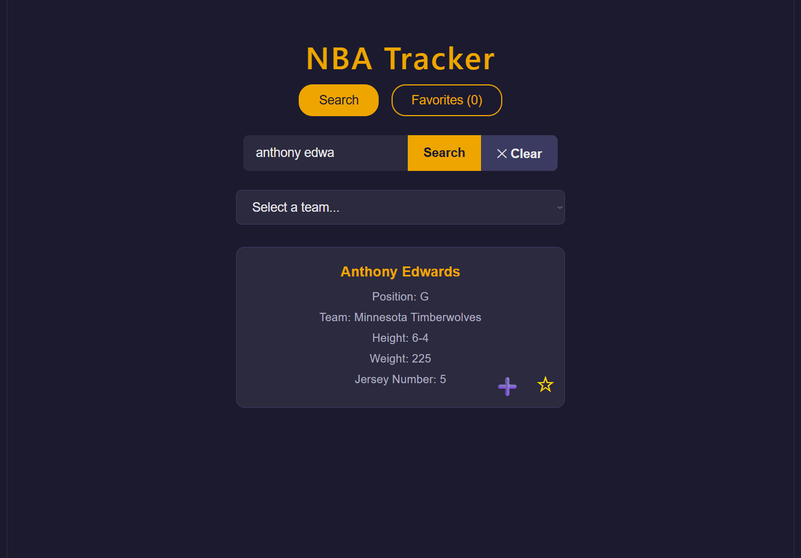
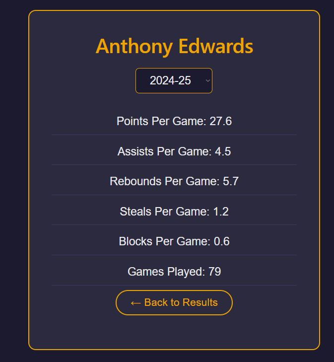
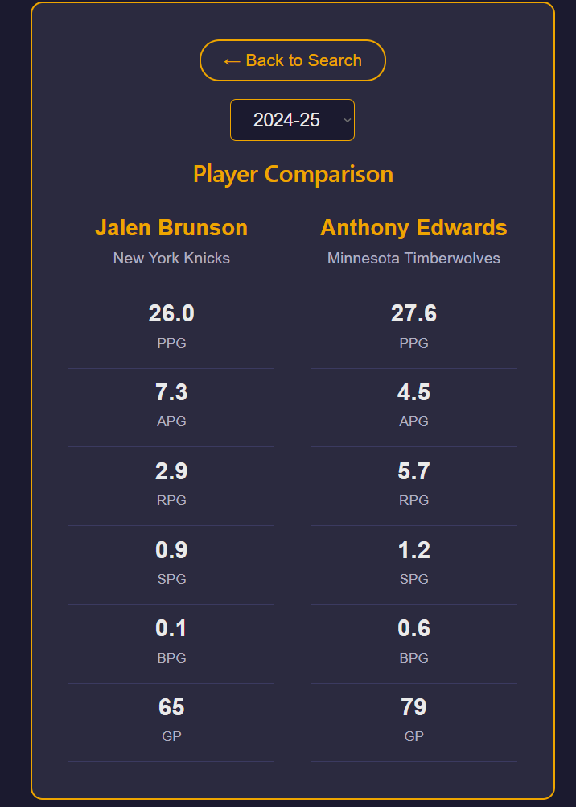
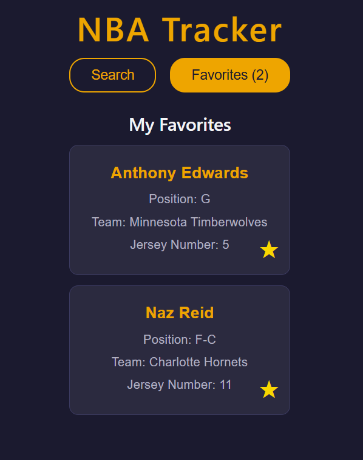

# NBA Stat Tracker

A full stack web application for tracking NBA players, browsing team rosters, viewing season stats, and comparing players side by side.

**Live Demo:** [nba-tracker-blond.vercel.app](https://nba-tracker-blond.vercel.app)

---

## Learning Goal

This was my first full stack project with a complete backend and frontend deployed. Originally started to get better with Java and OOP concepts but soon turned into a much larger passion project about the NBA. My goals were getting better with Java, learning more about OOP, learn a bit about frontend, React, JS, and more. Go Wolves!

---

## Features

- **Player Search** — Search any NBA player by name with full name filtering support
- **Team Browse** — Select from all 30 NBA teams to view current season stats leaders
- **Season Stats** — View per game averages (PPG, APG, RPG, SPG, BPG) with a season dropdown (2021-22 through 2024-25)
- **Player Comparison** — Select two players and compare their stats side by side
- **Favorites** — Save and unsave favorite players with persistent storage across sessions
- **Favorites Page** — View all saved players with clickable cards to see their stats

---

## Tech Stack

### Backend
- **Java 21**
- **Spring Boot 3.5** — REST API framework
- **Spring Data JPA** — Database ORM
- **H2** — In-memory database for favorites storage
- **Maven** — Dependency management
- **Deployed on Railway**

### Frontend
- **React 18** — Component-based UI
- **Vite** — Build tool and dev server
- **CSS** — Custom dark theme styling
- **localStorage** — Client-side persistence
- **Deployed on Vercel**

### External APIs
- **balldontlie.io** — NBA player search and team rosters
- **api.server.nbaapi.com** — Season stats and per game averages

---

## API Endpoints

| Method | Endpoint | Description |
|--------|----------|-------------|
| GET | `/api/players/search?name=` | Search players by name |
| GET | `/api/players/stats?playerName=&season=&team=` | Get player season stats |
| GET | `/api/players/team-stats?team=` | Get team stats leaders |
| GET | `/api/players` | Get all saved favorites |
| POST | `/api/players/favorites` | Save a favorite player |
| DELETE | `/api/players/{id}` | Remove a favorite player |
| GET | `/api/players/by-team?teamName=` | Filter saved players by team |
| GET | `/api/players/by-position?position=` | Filter saved players by position |
| GET | `/api/players/by-jersey?jerseyNumber=` | Filter saved players by jersey number |

---

## Project Structure

```
nba-tracker/
├── backend/                  # Spring Boot REST API
│   ├── src/main/java/com/zane/nba_tracker/
│   │   ├── controller/       # REST controllers
│   │   ├── service/          # Business logic
│   │   ├── repository/       # JPA repositories
│   │   ├── model/            # JPA entities
│   │   └── dto/              # Data transfer objects
│   └── pom.xml
└── frontend/                 # React application
    └── src/
        ├── components/       # React components
        │   ├── SearchBar.jsx
        │   ├── TeamSearch.jsx
        │   ├── PlayerCard.jsx
        │   ├── PlayerDetails.jsx
        │   ├── FavoriteButton.jsx
        │   ├── FavoriteCard.jsx
        │   ├── FavoritesPage.jsx
        │   ├── CompareView.jsx
        │   └── StatsCard.jsx
        ├── data/
        │   └── teams.js      # NBA team IDs and abbreviations
        └── App.jsx
```

---

## Local Development Setup

### Prerequisites
- Java 21+
- Node.js 18+
- Maven (or use the included `mvnw` wrapper)
- A free API key from [balldontlie.io](https://balldontlie.io)

### Backend

```bash
cd backend
```

Create `src/main/resources/application-local.properties`:
```properties
balldontlie.api.key=your_api_key_here
```

Run the backend:
```bash
./mvnw spring-boot:run
```

The API will be available at `http://localhost:8080`

### Frontend

```bash
cd frontend
npm install
npm run dev
```

The app will be available at `http://localhost:5173`

---

## Deployment

- **Backend** — Deployed on [Railway](https://railway.app) with environment variable `BALLDONTLIE_API_KEY`
- **Frontend** — Deployed on [Vercel](https://vercel.com) with root directory set to `frontend`


---

## Screenshots

> Search for any NBA player by name and view their full profile

> Click a player card to see their per game stats with a season selector

> Select two players to compare their stats side by side

> Save favorite players and access them anytime from the Favorites tab

---

## Known Limitations

- Stats are not available for all players due to free API data coverage
- Players who were traded mid-season may show as "2TM" in stats
- Favorites are stored in-memory on the backend (resets on server restart) and in localStorage on the client (persists across sessions)

---

## Author

**Zane** — [GitHub](https://github.com/zane)
